# Lộ Trình Phát Triển Hệ Thống SmartCV AI

> **Mục tiêu:** Xây dựng và hoàn thiện **Khung AI đa mô hình chạy cục bộ (Local Multi-Model AI Framework)** hỗ trợ đánh giá CV, phân tích năng lực chuẩn ATS, luyện tập kỹ năng và mô phỏng phỏng vấn tuyển dụng thông minh với khả năng vận hành độc lập offline và bảo mật thông tin tối đa.

---

## 🎯 5 Trụ Cột Kỹ Thuật Trọng Tâm

1. **Bảo mật & Chuẩn hóa Dữ liệu (PII Protection):**
   * Xây dựng pipeline tự động nhận diện và ẩn danh hóa thông tin cá nhân nhạy cảm (PII - Personally Identifiable Information: họ tên, số điện thoại, email, địa chỉ, CCCD, liên kết mạng xã hội).
   * Chuẩn hóa bộ dữ liệu Resume - JD song ngữ (Anh - Việt) phục vụ huấn luyện và đánh giá.

2. **Lọc CV Ngữ Nghĩa Siêu Tốc (Semantic Search & Vector Cache):**
   * Tối ưu hóa Sentence-Transformers đa ngôn ngữ (`paraphrase-multilingual-MiniLM-L12-v2`).
   * Nâng cấp cơ chế Vector Cache từ SQL Server sang Vector Store chuyên dụng hoặc index hóa hiệu năng cao để đáp ứng truy vấn hàng nghìn hồ sơ trong thời gian dưới 1 giây.

3. **Phân tích Năng lực & Chấm Điểm Chuẩn ATS Cục Bộ (Local ATS Engine):**
   * Chuyển đổi và tinh chỉnh mô hình ngôn ngữ chạy cục bộ (Local SLM/LLM như Qwen2.5 / Llama-3.1 qua QLoRA/Few-Shot).
   * Tự động bóc tách từ khóa, chấm điểm độ khớp (Match Score), chỉ ra kỹ năng còn thiếu (Skill Gaps) và đề xuất cải thiện hồ sơ theo tiêu chuẩn ATS.

4. **Phòng Phỏng Vấn Ảo & Sửa Lỗi Tiếng Anh (STAR Interview & English Polishing):**
   * Mô phỏng phỏng vấn tình huống tương tác thời gian thực theo cấu trúc STAR (*Situation, Task, Action, Result*).
   * Bóc tách và chấm điểm độc lập 4 tiêu chí STAR kèm phản hồi chi tiết.
   * Tích hợp trợ lý kiểm tra và sửa lỗi tiếng Anh chuyên sâu (ngữ pháp, từ vựng chuyên ngành, văn phong giao tiếp phỏng vấn).

5. **Đóng Gói Cụm Microservices Chạy Hoàn Toàn Offline (Offline Containerization):**
   * Đóng gói toàn bộ hệ sinh thái (ASP.NET Core MVC, SQL Server, Python NLP Service, Local LLM Inference Engine qua Docker Compose).
   * Tối ưu hóa mô hình với định dạng lượng tử hóa (Quantization 4-bit/8-bit GGUF) giúp vận hành mượt mà trên phần cứng máy trạm cục bộ mà không cần kết nối Internet.

---

## 🏗️ Sơ Đồ Kiến Trúc Hệ Thống & Quy Trình NCKH

Dưới đây là sơ đồ kiến trúc tổng thể kết hợp giữa **Hệ thống ứng dụng nghiệp vụ** và **Quy trình nghiên cứu khoa học (Huấn luyện & Thực nghiệm mô hình AI cục bộ)**:

```mermaid
flowchart TB
    %% ==========================================
    %% KHỐI 1: GIAO DIỆN & BACKEND ỨNG DỤNG
    %% ==========================================
    subgraph KHOI_1 ["1. HỆ THỐNG ỨNG DỤNG NGHIỆP VỤ (SMARTCV PLATFORM)"]
        direction LR
        UI["🖥️ GIAO DIỆN NGƯỜI DÙNG<br/>(Vue 3 CV Builder / Views)"] 
        BE["⚙️ BACKEND XỬ LÝ CHÍNH<br/>(ASP.NET Core Web API)"]
        DB[("🗄️ CƠ SỞ DỮ LIỆU<br/>(SQL Server)")]
        
        UI <-->|"HTTP / REST API"| BE
        BE <-->|"EF Core"| DB
    end

    %% ==========================================
    %% KHỐI 2: DỮ LIỆU & AI HỖ TRỢ
    %% ==========================================
    subgraph KHOI_2 ["2. DỮ LIỆU & CÔNG CỤ HỖ TRỢ NGHIÊN CỨU"]
        CloudLLM["☁️ CLOUD LLM (Gemini / Codex)<br/>• Sinh dữ liệu mẫu đối chứng (Data Synthesis)<br/>• Hỗ trợ sinh script tiền xử lý Python"]
        RawData["📁 KHO DỮ LIỆU ĐẶC THÙ (DATA)<br/>• Cấu trúc JSON/DB cụ thể, đa ngành nghề<br/>• Pattern: Title, Skill, Experience"]
        Preprocess["🧹 TIỀN XỬ LÝ & LÀM SẠCH (Python Pipeline)<br/>• Ẩn danh hóa thông tin cá nhân (PII De-id)<br/>• Chuẩn hóa cặp đối sánh: (Resume, JD)"]
        
        CloudLLM -->|"Hỗ trợ script/code"| Preprocess
        RawData --> Preprocess
    end

    %% ==========================================
    %% KHỐI 3: HUẤN LUYỆN LOCAL
    %% ==========================================
    subgraph KHOI_3 ["3. HUẤN LUYỆN & TINH CHỈNH CỤC BỘ (LOCAL TRAINING)"]
        BaseModels["📦 BASE MODELS CỤC BỘ (Open-source)<br/>• LLaMA 3 / Qwen (Local SLM ~ vài GB)<br/>• Sentence-Transformers (paraphrase-multilingual)"]
        TrainStep["⚡ HUẤN LUYỆN / TINH CHỈNH (Fine-Tuning)<br/>• Contrastive Learning / Multiple Negatives Ranking<br/>• QLoRA / Instruction Tuning (Chấm điểm ATS)"]
        ResultModel["🎯 MÔ HÌNH KẾT QUẢ (Result Model)<br/>• Thích ứng sâu với bộ dữ liệu CV-JD<br/>• Vận hành hoàn toàn Offline trên máy trạm"]
        
        BaseModels --> TrainStep
        TrainStep --> ResultModel
    end

    %% ==========================================
    %% KHỐI 4: ĐÁNH GIÁ THỰC NGHIỆM
    %% ==========================================
    subgraph KHOI_4 ["4. ĐÁNH GIÁ THỰC NGHIỆM KHOA HỌC (NCKH)"]
        TestData["🧪 TẬP KIỂM THỬ ĐỘC LẬP (Data Mới)<br/>(100 - 200 cặp CV-JD có nhãn chuẩn)"]
        OutputPred["📤 ĐẦU RA DỰ ĐOÁN (Output Suggestion)<br/>• % Điểm tương đồng ngữ nghĩa (Match Score)<br/>• Phân tích khoảng trống kỹ năng (Skill Gaps)"]
        Metrics["📊 CHỈ SỐ ĐO ĐẠC (Metric Benchmark)<br/>• Accuracy, Precision, Recall > 80%<br/>• Latency < 1.5s / 100 CVs"]
        
        TestData --> OutputPred
        OutputPred --> Metrics
    end

    %% ==========================================
    %% KHỐI 5: DỊCH VỤ SUY LUẬN NỘI BỘ
    %% ==========================================
    subgraph KHOI_5 ["5. DỊCH VỤ SUY LUẬN NỘI BỘ (LOCAL INFERENCE SERVICE)"]
        LocalAPI["🚀 AI MICROSERVICE (AiMatchService)<br/>(Python FastAPI / Ollama Service)<br/>• Vận hành độc lập offline, bảo mật 100%<br/>• 0đ chi phí Token API"]
    end

    %% ==========================================
    %% KẾT NỐI LIÊN KHỐI
    %% ==========================================
    Preprocess ==>|"Dữ liệu chuẩn hóa"| TrainStep
    ResultModel ==>|"Đánh giá mô hình"| OutputPred
    ResultModel ==>|"Đóng gói Model"| LocalAPI
    
    Metrics -.->|"Nếu < 80%: Tinh chỉnh lại"| TrainStep
    Metrics ==>|"Đạt chuẩn NCKH (> 80%)"| LocalAPI
    
    BE <===>|"REST API 2 chiều (JSON)"| LocalAPI
```

### Bảng Mô Tả Chức Năng Các Khối Kiến Trúc:
* **Khối 1 (Hệ Thống Ứng Dụng):** Nền tảng Web ASP.NET Core & Vue 3 CV Builder phụ trách tương tác người dùng và quản lý hồ sơ tuyển dụng.
* **Khối 2 (Dữ Liệu & Hỗ Trợ Nghiên Cứu):** Chuẩn hóa kho dữ liệu Resume-JD, lọc thông tin định danh (PII); Cloud LLM chỉ đóng vai trò sinh dữ liệu đối chứng và sinh script.
* **Khối 3 (Huấn Luyện Cục Bộ):** Thực hiện Fine-tuning (QLoRA / Contrastive Learning) trên các mô hình mã nguồn mở (LLaMA 3, Qwen, Sentence-Transformers) với kích thước vài GB.
* **Khối 4 (Đánh Giá Thực Nghiệm):** Đánh giá khách quan trên tập dữ liệu kiểm thử mới, đo lường các chỉ số khoa học: Accuracy, Precision, Recall (> 80%) và độ trễ (Latency).
* **Khối 5 (Dịch Vụ Suy Luận Nội Bộ):** Đóng gói mô hình đạt chuẩn thành Microservice (Python FastAPI / Ollama), cung cấp API nội bộ cho Backend với độ trễ thấp, 0đ chi phí và bảo mật tuyệt đối.

---

## 📅 Lộ Trình 12 Tuần Chi Tiết

### Giai đoạn 1: Chuẩn Hóa Dữ Liệu & Hạ Tầng Mô Hình Cục Bộ (Tuần 1 - Tuần 4)

* **Tuần 1 - 2: Xây dựng Pipeline ẩn danh PII & Bộ dữ liệu song ngữ**
  * Thiết kế module xử lý PII (Regex kết hợp Named Entity Recognition - NER) để làm sạch kho CV và JD.
  * Chuẩn hóa cấu trúc JSON cho kho dữ liệu Resume - JD song ngữ phục vụ kiểm thử và đánh giá.
  * Xây dựng endpoint API ẩn danh hóa dữ liệu trước khi gửi vào các mô hình phân tích.

* **Tuần 3 - 4: Dựng hạ tầng Local AI Engine & Nâng cấp Vector Cache**
  * Tích hợp Local LLM Runner (Ollama / vLLM / llama.cpp) vào cấu trúc Microservices của hệ thống.
  * Lựa chọn và kiểm thử mô hình nền tảng phù hợp cho tiếng Việt và tiếng Anh (khuyến nghị: *Qwen2.5-7B-Instruct-Q4_K_M* hoặc *Llama-3.1-8B-Instruct*).
  * Benchmark tốc độ phản hồi và dung lượng bộ nhớ của Vector Cache so khớp CV hiện tại.

---

### Giai đoạn 2: Tinh Chỉnh Mô Hình & Hoàn Thiện Tính Năng Cốt Lõi (Tuần 5 - Tuần 8)

* **Tuần 5 - 6: Động cơ Chấm điểm ATS & Bảng Phân Tích Chuyên Sâu**
  * Xây dựng pipeline trích xuất thực thể ATS: Kỹ năng bắt buộc (Hard skills), Kỹ năng mềm (Soft skills), Số năm kinh nghiệm và Bằng cấp/Chứng chỉ.
  * Tinh chỉnh prompt có cấu trúc (Structured Outputs JSON) trên Local LLM để chấm điểm độ tương thích chính xác cao.
  * Thiết kế giao diện Dashboard phân tích ATS chi tiết cho nhà tuyển dụng và ứng viên trên giao diện Web.

* **Tuần 7 - 8: Phòng Phỏng Vấn STAR & Module Sửa Lỗi Tiếng Anh**
  * Nâng cấp giao diện phòng phỏng vấn: Thêm bảng phân tích 4 thành phần S-T-A-R cho từng câu trả lời.
  * Bổ sung chế độ phỏng vấn bằng Tiếng Anh (English Interview Mode).
  * Phát triển module AI bắt lỗi ngữ pháp tiếng Anh, gợi ý từ vựng chuyên ngành và viết lại câu trả lời theo chuẩn văn phong phỏng vấn quốc tế.

---

### Giai đoạn 3: Đóng Gói Docker Offline, Tối Ưu & Nghiệm Thu (Tuần 9 - Tuần 12)

* **Tuần 9 - 10: Đóng gói cụm Docker hoàn chỉnh & Kiểm thử Offline**
  * Cập nhật `docker-compose.yml` tích hợp trọn gói 4 dịch vụ: Web Backend (.NET 10), Database (MSSQL), Python AI Service (FastAPI) và Local LLM Service (Ollama Container).
  * Kiểm thử ngắt toàn bộ kết nối Internet của máy chủ: Đảm bảo toàn bộ luồng tạo CV, lọc ứng viên, phân tích ATS và phỏng vấn hoạt động 100% offline.
  * Tối ưu hóa tài nguyên phần cứng (RAM, VRAM, CPU) khi khởi chạy đồng thời cụm dịch vụ.

* **Tuần 11 - 12: Đo lường Thực nghiệm, Hoàn thiện Tài liệu Kỹ thuật & Bàn Giao**
  * Thực hiện đo đạc các chỉ số kỹ thuật: Thời gian phản hồi trung bình (Inference Latency), Độ chính xác lọc CV (Precision/Recall/F1-Score), Mức tiêu thụ tài nguyên phần cứng.
  * Tổng hợp báo cáo kỹ thuật toàn diện, sơ đồ kiến trúc hệ thống và hướng dẫn triển khai.
  * Nghiệm thu chất lượng sản phẩm và chuẩn bị tài liệu công bố kết quả kỹ thuật.

---

## 👥 Phân Bổ Nhiệm Vụ Đội Ngũ (Nhóm 4 Kỹ Sư)

| Kỹ sư đảm nhận | Trách nhiệm chính | Sản phẩm bàn giao |
| :--- | :--- | :--- |
| **Kỹ sư 1 (Trưởng nhóm / Kiến trúc hệ thống)** | Thiết kế tổng thể kiến trúc Local Multi-Model AI Framework, thiết lập hạ tầng Local LLM Inference, tối ưu hóa Docker Compose đa container, điều phối tiến độ và biên soạn tài liệu kỹ thuật tổng thể. | Cụm Docker Offline hoàn chỉnh, tài liệu kiến trúc hệ thống và báo cáo tổng kết. |
| **Kỹ sư 2 (Kỹ sư Dữ liệu & Xử lý PII)** | Xây dựng pipeline làm sạch và ẩn danh hóa PII, chuẩn hóa tập dữ liệu Resume - JD song ngữ, thiết kế prompt/tinh chỉnh mô hình phân tích năng lực chuẩn ATS. | Module PII De-identification, kho dữ liệu song ngữ chuẩn hóa, động cơ phân tích ATS. |
| **Kỹ sư 3 (Kỹ sư AI Xử lý Ngôn ngữ & Phỏng vấn)** | Nâng cấp mô phỏng phỏng vấn tình huống STAR, xây dựng module chấm điểm 4 tiêu chí STAR, phát triển trợ lý sửa lỗi Tiếng Anh chuyên sâu trong phòng phỏng vấn. | Bộ API phỏng vấn STAR, module phân tích ngữ pháp & văn phong tiếng Anh. |
| **Kỹ sư 4 (Kỹ sư Fullstack Web & Đo lường Hiệu năng)** | Xây dựng giao diện ATS Analysis Dashboard và phòng phỏng vấn mới trên Web, kết nối các luồng API C# - Python, thực hiện đo đạc thực nghiệm các chỉ số hiệu năng (Latency, RAM/VRAM, Accuracy). | Giao diện Web ATS & Interview hoàn chỉnh, bộ số liệu đo đạc thực nghiệm và biểu đồ so sánh. |

---

## 📊 Chỉ Số Nghiệm Thu Kỹ Thuật (KPIs & Acceptance Criteria)

1. **Khả năng Offline 100%:** Toàn bộ hệ thống khởi động và thực thi đầy đủ các chức năng (Tạo CV, Lọc SmartMatch, Chấm điểm ATS, Phỏng vấn STAR) khi ngắt kết nối mạng Internet.
2. **Thời gian đáp ứng (Latency):**
   * Lọc và xếp hạng top CV ứng viên theo ngữ nghĩa: `< 1.5 giây` cho 100 CV đã qua Vector Cache.
   * Phân tích ATS chi tiết bằng Local LLM: `< 10 - 15 giây` / hồ sơ trên GPU cá nhân phổ thông (từ 8GB VRAM).
   * Phản hồi câu hỏi phỏng vấn tương tác: `< 3 - 5 giây` / lượt hội thoại.
3. **Độ an toàn dữ liệu PII:** Tỷ lệ phát hiện và làm sạch các trường dữ liệu định danh cá nhân nhạy cảm đạt tối thiểu `≥ 95%`.
4. **Tính tương thích phần cứng:** Hệ thống vận hành ổn định trên máy chủ/máy trạm có cấu hình tối thiểu: CPU 8 cores, RAM 16GB-32GB, GPU NVIDIA VRAM 8GB trở lên.
